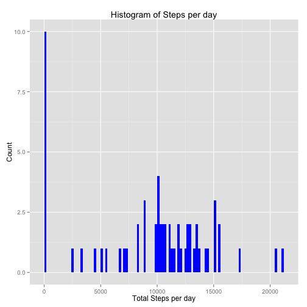
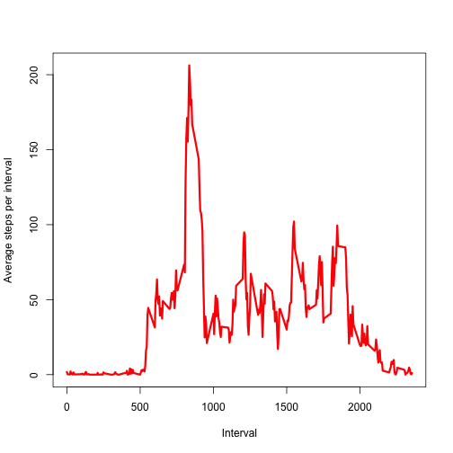
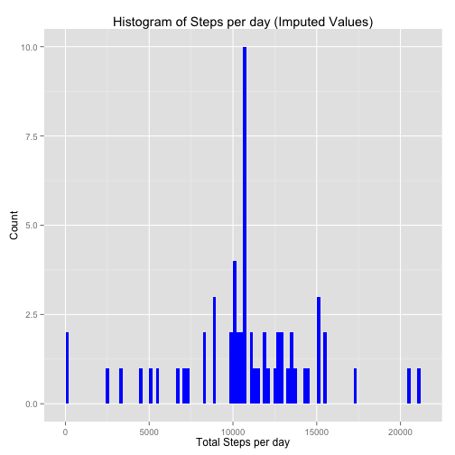
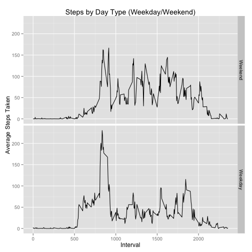

## Including R Libraries
We include the two R libraries we need for our R code to work

```r
library(ggplot2)
library(dplyr)
```
## Loading and preprocessing the data
1. Load the data (i.e. read.csv())
We assume that the data is there in the working directory and has been unzipped. The data file name is assumed to be activity.csv. We load the data using read.csv


```r
activity <- read.csv("activity.csv");
```

2. Process/transform the data (if necessary) into a format suitable for your analysis

We convert the date column to Date type

```r
activity$date <- as.Date(activity$date)
```

## What is mean total number of steps taken per day?

For this part of the assignment, you can ignore the missing values in the dataset.

### Make a histogram of the total number of steps taken each day

To calculate the mean steps for each day, we use the dplyr functions to group by date and calculate the mean for each day. Here we assume that we should REMOVE the NA values (that is my interpretation of "ignore" NA values).

```r
total_steps_per_day <- activity %>% group_by(date) %>% summarize(total_steps = sum(steps, na.rm=TRUE))
```

We then make a histogram of total number of steps taken each day


```r
hist = ggplot(data=total_steps_per_day, aes(x=total_steps)) + geom_histogram(fill="blue", binwidth=200) 
hist = hist + labs(title="Histogram of Steps per day") + 
       xlab("Total Steps per day") + ylab("Count")
print(hist)
```

 

### Calculate and report the mean and median total number of steps taken per day

We report both the mean/median for each day and the overall mean/median for all days. The overall mean steps per day = **9354.23** and overall median steps per day = **10395**.


```r
mean_and_median_steps_per_day <- 
    activity %>% group_by(date) %>% summarize(mean_steps = mean(steps), median_steps=median(steps))
print (mean_and_median_steps_per_day)
```

```
## Source: local data frame [61 x 3]
## 
##          date mean_steps median_steps
## 1  2012-10-01         NA           NA
## 2  2012-10-02  0.4375000            0
## 3  2012-10-03 39.4166667            0
## 4  2012-10-04 42.0694444            0
## 5  2012-10-05 46.1597222            0
## 6  2012-10-06 53.5416667            0
## 7  2012-10-07 38.2465278            0
## 8  2012-10-08         NA           NA
## 9  2012-10-09 44.4826389            0
## 10 2012-10-10 34.3750000            0
## 11 2012-10-11 35.7777778            0
## 12 2012-10-12 60.3541667            0
## 13 2012-10-13 43.1458333            0
## 14 2012-10-14 52.4236111            0
## 15 2012-10-15 35.2048611            0
## 16 2012-10-16 52.3750000            0
## 17 2012-10-17 46.7083333            0
## 18 2012-10-18 34.9166667            0
## 19 2012-10-19 41.0729167            0
## 20 2012-10-20 36.0937500            0
## 21 2012-10-21 30.6284722            0
## 22 2012-10-22 46.7361111            0
## 23 2012-10-23 30.9652778            0
## 24 2012-10-24 29.0104167            0
## 25 2012-10-25  8.6527778            0
## 26 2012-10-26 23.5347222            0
## 27 2012-10-27 35.1354167            0
## 28 2012-10-28 39.7847222            0
## 29 2012-10-29 17.4236111            0
## 30 2012-10-30 34.0937500            0
## 31 2012-10-31 53.5208333            0
## 32 2012-11-01         NA           NA
## 33 2012-11-02 36.8055556            0
## 34 2012-11-03 36.7048611            0
## 35 2012-11-04         NA           NA
## 36 2012-11-05 36.2465278            0
## 37 2012-11-06 28.9375000            0
## 38 2012-11-07 44.7326389            0
## 39 2012-11-08 11.1770833            0
## 40 2012-11-09         NA           NA
## 41 2012-11-10         NA           NA
## 42 2012-11-11 43.7777778            0
## 43 2012-11-12 37.3784722            0
## 44 2012-11-13 25.4722222            0
## 45 2012-11-14         NA           NA
## 46 2012-11-15  0.1423611            0
## 47 2012-11-16 18.8923611            0
## 48 2012-11-17 49.7881944            0
## 49 2012-11-18 52.4652778            0
## 50 2012-11-19 30.6979167            0
## 51 2012-11-20 15.5277778            0
## 52 2012-11-21 44.3993056            0
## 53 2012-11-22 70.9270833            0
## 54 2012-11-23 73.5902778            0
## 55 2012-11-24 50.2708333            0
## 56 2012-11-25 41.0902778            0
## 57 2012-11-26 38.7569444            0
## 58 2012-11-27 47.3819444            0
## 59 2012-11-28 35.3576389            0
## 60 2012-11-29 24.4687500            0
## 61 2012-11-30         NA           NA
```

```r
overall_mean_steps_per_day = mean(total_steps_per_day$total_steps);
overall_median_steps_per_day = median(total_steps_per_day$total_steps);

print (overall_mean_steps_per_day)
```

```
## [1] 9354.23
```

```r
print (overall_median_steps_per_day)
```

```
## [1] 10395
```

## What is the average daily activity pattern?

### Make a time series plot (i.e. type = "l") of the 5-minute interval (x-axis) and the average number of steps taken, averaged across all days (y-axis)

We calculate average steps per interval and then make a time series plot.

```r
avg_steps_per_interval <- activity %>% group_by(interval) %>% summarize(avg_steps = mean(steps, na.rm=TRUE))
plot(avg_steps_per_interval$interval, avg_steps_per_interval$avg_steps, 
     type="l", xlab="Interval", ylab="Average steps per interval", 
     col="red", lwd=3)
```

 
### Which 5-minute interval, on average across all the days in the dataset, contains the maximum number of steps?

The interval that contains maximum number of steps averaged across all the days is **835** as calculated below:

```r
avg_steps_per_interval %>% filter(avg_steps == max(avg_steps_per_interval$avg_steps))
```

```
## Source: local data frame [1 x 2]
## 
##   interval avg_steps
## 1      835  206.1698
```

## Imputing missing values

### Calculate and report the total number of missing values in the dataset (i.e. the total number of rows with NAs)

The total missing values is **2304** as calculated below.

```r
sum(is.na(activity$steps)) 
```

```
## [1] 2304
```

### Devise a strategy for filling in all of the missing values in the dataset. The strategy does not need to be sophisticated. For example, you could use the mean/median for that day, or the mean for that 5-minute interval, etc.

Our strategy is to replace NA value with the mean NA for that interval id. 

### Create a new dataset that is equal to the original dataset but with the missing data filled in.

Following code stores the new data set in the variable *activity_nas_replaced*


```r
#Create a new dataset that is equal to the original dataset but with the missing data filled in.
activity_nas_replaced <- activity %>% group_by(interval) %>% mutate(steps = ifelse(is.na(steps), mean(steps,na.rm=TRUE), steps))
```

### Make a histogram of the total number of steps taken each day and Calculate and report the mean and median total number of steps taken per day. Do these values differ from the estimates from the first part of the assignment? What is the impact of imputing missing data on the estimates of the total daily number of steps?

We make a nistogram of new total steps per day after imputing values


```r
total_steps_per_day_imputed <- activity_nas_replaced %>% group_by(date) %>% summarize(total_steps = sum(steps))

hist = ggplot(data=total_steps_per_day_imputed, aes(x=total_steps)) +
    geom_histogram(fill="blue", binwidth=200)
hist = hist + labs(title="Histogram of Steps per day (Imputed Values)") +
       xlab("Total Steps per day") + ylab("Count")
print(hist)
```

 

## Are there differences in activity patterns between weekdays and weekends?

### Create a new factor variable in the dataset with two levels -- "weekday" and "weekend" indicating whether a given date is a weekday or weekend day.


```r
isWeekDay <- function(d) {
  w <- c("Monday", "Tuesday", "Wednesday", "Thursday", "Friday")
  is.element(weekdays(as.Date(d)), w)
}

# create a new column "day_type" and store in a new data frame "activity_with_weekday"
activity_with_weekday <-activity_nas_replaced %>% mutate(day_type = factor(isWeekDay(date), levels=c(FALSE, TRUE), labels=c("Weekend", "Weekday")))
```

### Make a panel plot containing a time series plot (i.e. type = "l") of the 5-minute interval (x-axis) and the average number of steps taken, averaged across all weekday days or weekend days (y-axis). The plot should look something like the following, which was created using simulated data:


```r
avg_steps_by_weekday_weekend <- activity_with_weekday %>% group_by(interval, day_type) %>% summarize(avg_steps_weekday_weekend=mean(steps))
qplot(interval, avg_steps_weekday_weekend, data=avg_steps_by_weekday_weekend, geom=c("line"),
   facets= day_type ~ ., main="Steps by Day Type (Weekday/Weekend)", xlab="Interval", ylab="Average Steps Taken")
```

 
